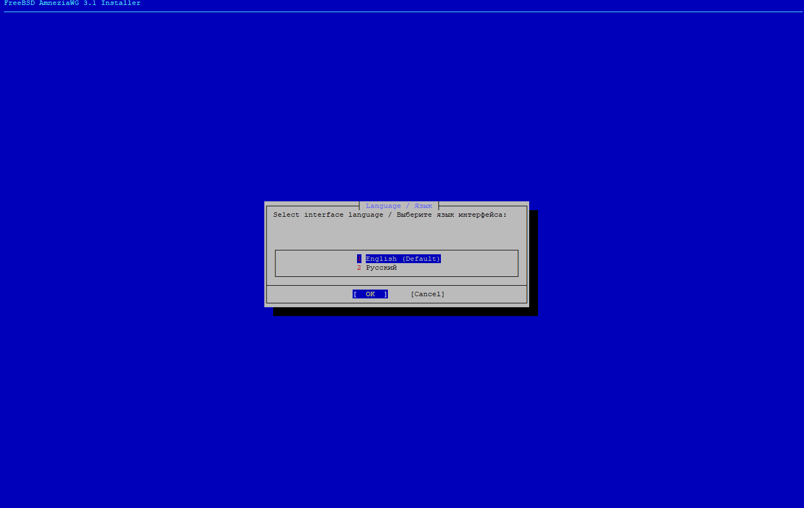
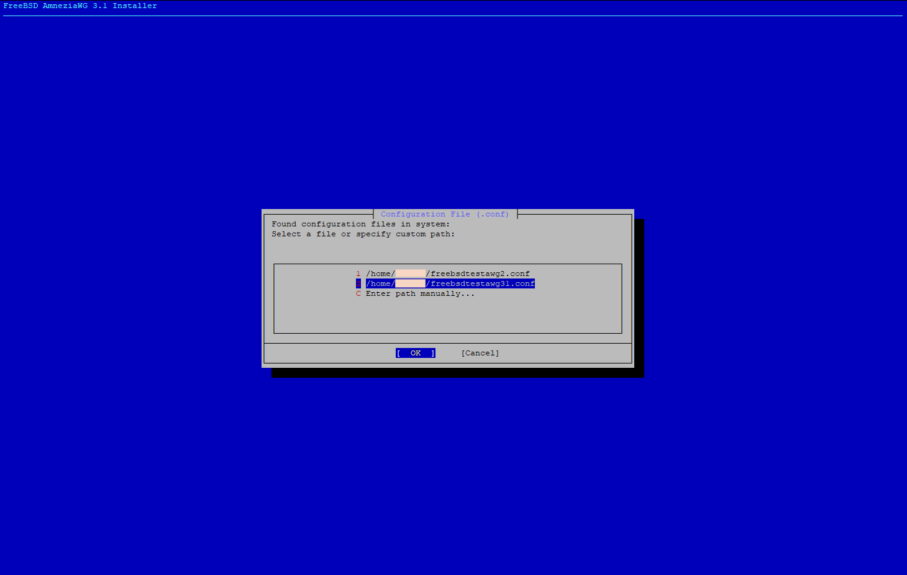
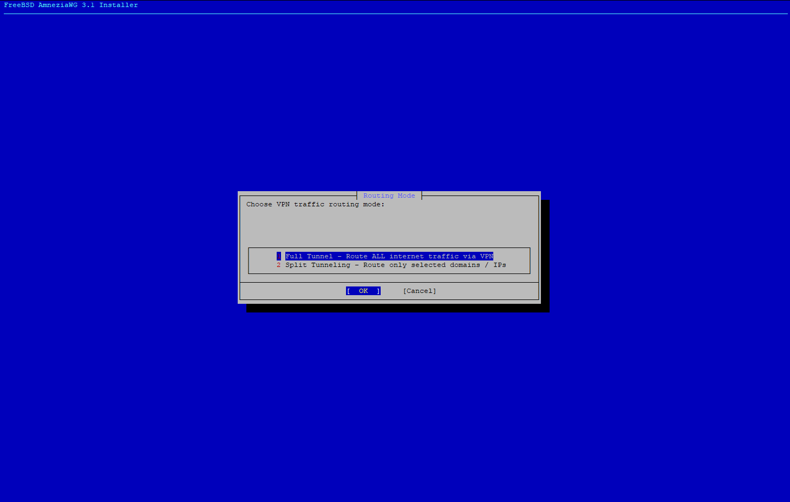
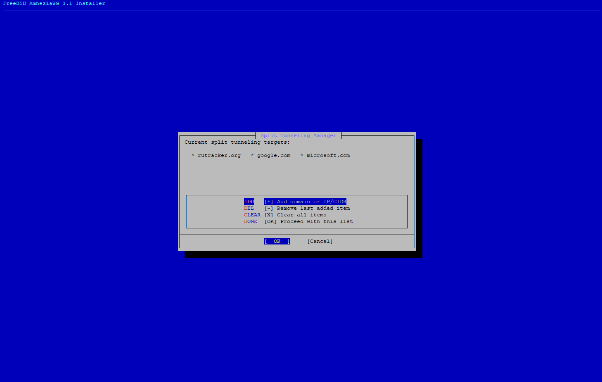
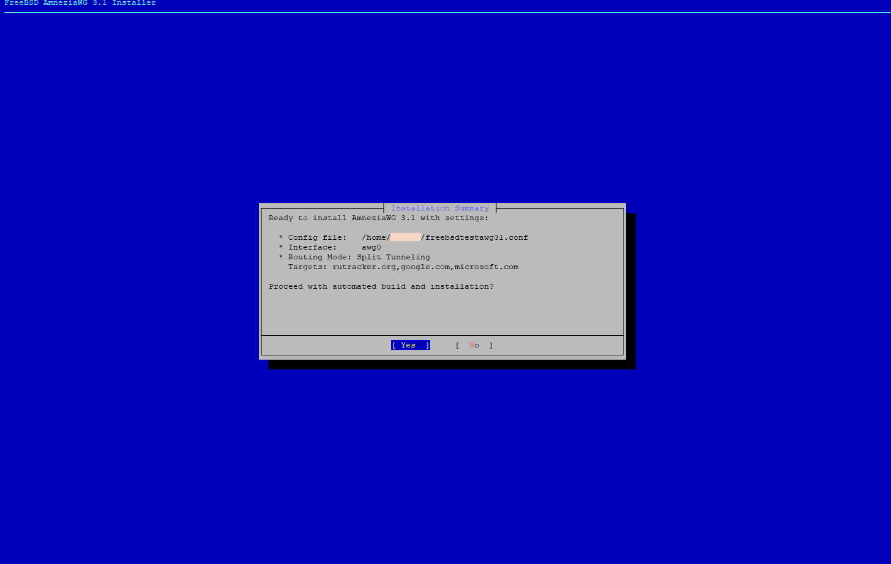
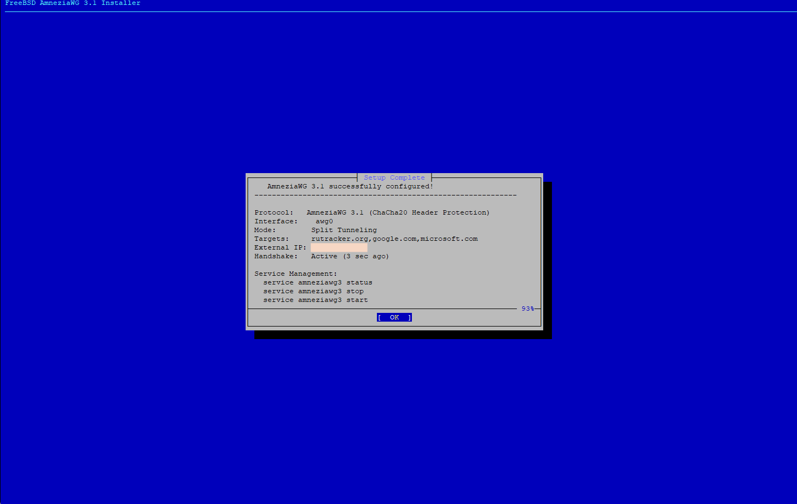

# AmneziaWG FreeBSD — Пошаговое иллюстрированное руководство

**[🇺🇸 English Manual](MANUAL.md)** | **[⬅ На главную README](../README.ru.md)**

---

В этом руководстве детально показан процесс настройки **AmneziaWG** на FreeBSD с использованием встроенного интерактивного **TUI-мастера** (`bsddialog`).

Мастер встроен в оба установочных скрипта:
* **[`awg2-setup.sh`](../awg2-setup.sh)** — для протоколов AmneziaWG 2.0 / 1.0 (стандартные пакеты `pkg`)
* **[`awg3-setup.sh`](../awg3-setup.sh)** — для новейшего протокола AmneziaWG 3.1 (ChaCha20 Header Protection и динамический паддинг)

---

## Запуск мастера

Запустите скрипт с правами суперпользователя без передачи параметров:

```bash
# Для AmneziaWG 3.1:
sudo ./awg3-setup.sh

# Либо для AmneziaWG 2.0 / 1.0:
sudo ./awg2-setup.sh
```

---

## Шаг 1: Выбор языка интерфейса

При старте установщик открывает диалоговое окно выбора языка. Доступны:
* **`English (Default)`** — Английский интерфейс и лог сообщений
* **`Русский`** — Полная локализация интерфейса мастера на русском языке



Перемещение по пунктам осуществляется стрелками `Вверх`/`Вниз`, подтверждение клавишей `Enter` или кнопкой `[ OK ]`.

---

## Шаг 2: Поиск и выбор файла конфигурации (.conf)

Мастер автоматически производит сканирование стандартных каталогов на наличие файлов конфигурации AmneziaWG:
* Текущий каталог (`./*.conf`)
* Домашние каталоги пользователей (`/home/*/*.conf`, `/root/*.conf`)
* Системные каталоги (`/etc/*.conf`, `/usr/local/etc/*.conf`)



* **Выбор найденного файла**: Нажмите соответствующую цифру (например, `1`, `2`) и выберите `[ OK ]`.
* **Ручной ввод пути**: Выберите пункт `C Enter path manually...` / `Ввести путь вручную...`, чтобы указать произвольный путь к `.conf` файлу.

---

## Шаг 3: Режим маршрутизации трафика

Выберите нужный режим перенаправления сетевого трафика:



1. **`Full Tunnel - Route ALL internet traffic via VPN` (Полный туннель)**:
   * Весь сетевой трафик узла FreeBSD инкапсулируется и отправляется через туннель AmneziaWG.
   * Эквивалент переопределения шлюза по умолчанию (`0.0.0.0/0`, `::/0`).

2. **`Split Tunneling - Route only selected domains / IPs` (Раздельное туннелирование)**:
   * Через VPN маршрутизируется трафик исключительно к выбранным доменам или IP-подсетям.
   * Весь остальной трафик идёт напрямую через шлюз провайдера.
   * Используется нативная таблица маршрутизации FreeBSD с автоматическим резолвом пулов Anycast (Cloudflare, Google, Akamai).

---

## Шаг 4: Менеджер раздельного туннелирования

*(Отображается только при выборе режима "Split Tunneling" на Шаге 3)*

Менеджер позволяет просматривать текущие цели, добавлять новые и удалять ненужные перед началом применения настроек:



### Доступные действия:
* **`ADD [+] Add domain or IP/CIDR`**: Открывает поле ввода для добавления одного или нескольких целевых адресов через запятую или пробел (например, `rutracker.org, google.com, microsoft.com, 198.51.100.0/24`).
* **`DEL [-] Remove last added item`**: Удаляет последнюю добавленную запись из списка.
* **`CLEAR [X] Clear all items`**: Очищает весь список целей.
* **`DONE [OK] Proceed with this list`**: Подтверждает список адресов и переходит к экрану сводки.

---

## Шаг 5: Итоговая сводка и подтверждение

Перед внесением любых изменений в систему, сборкой драйвера или созданием интерфейсов мастер выводит окно итоговой сводки:



* **Config file**: Полный путь к выбранному конфигурационному файлу.
* **Interface**: Имя сетевого интерфейса (`awg0` по умолчанию).
* **Routing Mode**: `Full Tunnel` или `Split Tunneling` (со списком назначенных доменов и подсетей).

Выберите **`[ Yes ]`** для запуска автоматической установки, сборки/загрузки модуля ядра и запуска сервиса. Нажмите **`[ No ]`**, чтобы безопасно прервать работу без изменения состояния системы.

---

## Шаг 6: Завершение настройки и автоматическая проверка

После завершения инициализации открывается финальное информационное окно со статусом подключения в реальном времени:



### Проверенные параметры:
* **Protocol**: Версия протокола и драйвера (например, `AmneziaWG 3.1 (ChaCha20 Header Protection)`).
* **Interface**: Имя активного интерфейса (`awg0`).
* **Mode**: Активный режим маршрутизации и назначенные цели.
* **External IP**: Публичный IP-адрес, проверенный через туннель.
* **Handshake**: Зафиксированное рукопожатие с пиром (например, `Active (3 sec ago)`).

---

## Управление туннелем и сервисом

После установки туннель и созданные маршруты автоматически восстанавливаются при перезагрузке FreeBSD через подсистему `rc.d`.

### Служба AWG 3.1 (`awg3-setup.sh`):
```bash
sudo service amneziawg3 status   # Проверить статус туннеля и активность рукопожатия
sudo service amneziawg3 stop     # Остановить туннель и удалить маршруты
sudo service amneziawg3 start    # Запустить туннель и восстановить маршруты
sudo awg show awg0               # Детальная статистика протокола и обфускации
```

### Служба AWG 2.0 / 1.0 (`awg2-setup.sh`):
```bash
sudo service amneziawg status    # Проверить статус службы
sudo service amneziawg stop      # Остановить службу
sudo service amneziawg start     # Запустить службу
sudo awg show awg0               # Статистика пира и переданного трафика
```

### Проверка раздельной маршрутизации:
```bash
# Просмотр всех маршрутов, привязанных к интерфейсу awg0:
netstat -rn | grep awg0

# Проверка маршрута для конкретного домена:
route get rutracker.org
route get google.com

# Проверка доступности сайта через curl:
curl -4 -I https://rutracker.org
```

---

## Режим командной строки (CLI / Неинтерактивный)

Для автоматизированного развертывания или использования в скриптах диалоговый мастер можно пропустить, передав аргументы в командной строке:

```bash
# AmneziaWG 3.1 — Полный туннель:
sudo ./awg3-setup.sh -c /путь/к/vpn.conf

# AmneziaWG 3.1 — Раздельное туннелирование:
sudo ./awg3-setup.sh -c /путь/к/vpn.conf -d "rutracker.org,google.com,microsoft.com"

# AmneziaWG 2.0 / 1.0 — Раздельное туннелирование:
sudo ./awg2-setup.sh -c /путь/к/vpn.conf -d "rutracker.org,google.com,microsoft.com"
```
